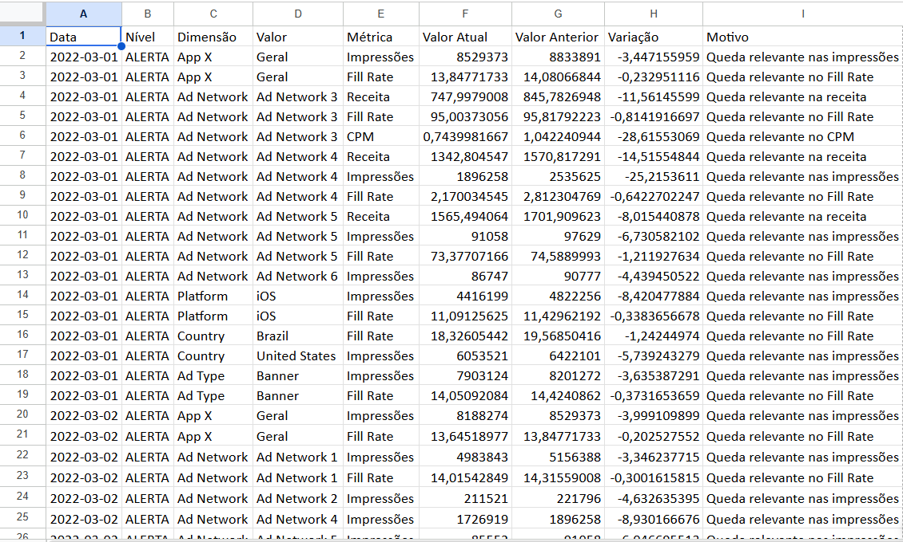

# 🚨 Alerta Automático de Performance — App X

Projeto desenvolvido para o case de **Ad Monetization Engineering**, com o objetivo de identificar automaticamente quedas relevantes nas métricas de monetização do App X.

## 🎯 Objetivo

O sistema analisa os dados históricos de monetização e identifica automaticamente possíveis problemas de performance, evitando que seja necessário realizar uma análise manual diariamente.

As principais métricas monitoradas são:

- Impressões
- Receita
- Fill Rate
- CPM
- Atividade por Ad Network
- Atividade por Platform
- Atividade por Country
- Atividade por Ad Type

---

## ⚙️ Como funciona

O script realiza uma análise em duas camadas:

### 1. Monitoramento geral

As métricas do App X são agrupadas por dia e comparadas com o dia anterior.

São gerados alertas quando uma métrica apresenta uma queda superior ao threshold definido.

### 2. Monitoramento segmentado

Além do resultado geral, o sistema analisa diferentes dimensões da monetização:

- Ad Network
- Platform
- Country
- Ad Type

Isso permite identificar problemas que poderiam ficar escondidos quando analisamos somente os resultados totais do aplicativo.

Por exemplo, se uma Ad Network possuía impressões no dia anterior e passa a apresentar **zero impressões**, o sistema classifica o evento como **CRÍTICO**.

---

## 📊 Thresholds utilizados

| Métrica | Threshold |
|---|---:|
| Receita | -3% |
| Impressões | -3% |
| Fill Rate | -0,2 p.p. |
| CPM | -5% |
| Impressões = 0 | Crítico |
| Receita = 0 | Crítico |

Os thresholds foram escolhidos buscando equilibrar **sensibilidade na detecção de problemas** e **redução de falsos positivos**.

Como a base possui poucos dias de histórico, foi utilizada uma abordagem baseada em thresholds e comparação com o dia anterior, evitando depender exclusivamente de métodos estatísticos.

---

## 🚦 Níveis de alerta

### 🔴 CRÍTICO

Utilizado quando uma dimensão que apresentava atividade anteriormente passa a apresentar:

- Zero impressões
- Zero receita

### 🟠 ALERTA

Gerado quando uma métrica apresenta uma queda superior ao threshold definido.

### 🟡 ATENÇÃO

Indica uma situação que merece investigação, mas que não necessariamente representa uma falha.

---

## 📈 Exemplo de saída

O sistema gera uma planilha contendo os pontos de atenção encontrados:



A saída apresenta informações como:

- Data
- Nível do alerta
- Dimensão afetada
- Métrica
- Valor atual
- Valor anterior
- Variação
- Motivo do alerta

---

## 🔎 Exemplo identificado

Na análise do App X, o sistema identificou uma queda relevante em **03/03/2022**.

Nesse dia:

- As impressões caíram aproximadamente **4,15%**
- A receita caiu aproximadamente **4,25%**
- O CPM permaneceu praticamente estável

Isso indica que a queda de receita está mais relacionada à **redução do volume de impressões** do que a uma redução no valor gerado por cada mil impressões.

---

## 🛠️ Tecnologias

- Python
- Pandas
- OpenPyXL
- Excel
- Git / GitHub

---

## ▶️ Como executar

Clone o repositório:

```bash
git clone https://github.com/GabiMota12/teste-monetizacao.git